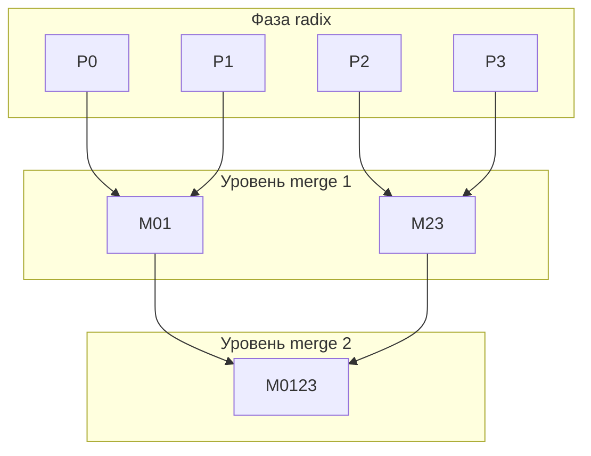

# Поразрядная сортировка целых чисел с простым слиянием (последовательная, OpenMP, TBB, STL и ALL версии)

**Вариант № 17**  
**Студент:** Соснина Александра Антоновна  
**Группа:** 3823Б1ПР1  
**Преподаватель:** Сысоев Александр Владимирович, доцент

---

## Введение

Сортировка данных - одна из фундаментальных операций в вычислительной практике, необходимая в базах данных,
обработке сигналов, графах и многих других приложениях.

Поразрядная сортировка целых чисел (radix sort) при фиксированной разрядности позволяет достичь линейной
трудоёмкости по числу элементов. Для корректного упорядочивания знаковых целых величин используется
приведение к беззнаковому представлению с последующим обратным преобразованием. После независимой сортировки
частей массива отсортированные фрагменты объединяются последовательностью парных слияний (дерево merge).

В условиях современного параллельного программирования реализация такого алгоритма с использованием различных
технологий (OpenMP, TBB, средств C++, а также комбинации **MPI-процессов** и **потоков** в варианте `all`)
позволяет исследовать эффективность распараллеливания и выбрать подходящий вариант в зависимости от аппаратной
платформы и размера входа.

## Постановка задачи

**Цель работы:**  
Реализовать последовательную и параллельные версии алгоритма поразрядной LSD-сортировки целых чисел с
последующим слиянием отсортированных частей, провести их тестирование и сравнить производительность.

**Определение задачи:**  
Дан массив целых чисел. Требуется получить его перестановку, упорядоченную по неубыванию. Алгоритм разбивает
массив на несколько непересекающихся частей, каждую часть сортирует поразрядно, затем на каждом уровне дерева
попарно сливает соседние уже отсортированные последовательности устойчивым слиянием.

**Ограничения:**

- Входной массив не должен быть пустым (в соответствии с условиями валидации задачи).
- Корректность проверяется отсортированностью выхода и совпадением мультимножества значений с входом (в тестах
сравнение с эталоном после `std::sort`).

## Описание алгоритма (последовательная версия)

Последовательный алгоритм для всего массива (или для одной части при параллельной декомпозиции) выполняет
следующее.

1. Элементы приводятся к виду, удобному для поразрядной сортировки знаковых целых (XOR с константой
  `0x80000000`), чтобы порядок битов соответствовал обычному сравнению `int`.
2. Выполняется несколько проходов LSD по фиксированному числу бит (например, по 8 бит за проход). На каждом
  проходе: подсчёт частот «цифр», вычисление префиксных сумм, распределение элементов во вспомогательный
   буфер, обмен массивов.
3. После проходов выполняется обратное XOR для восстановления знаковых значений.
4. Если массив не разбит на части, после поразрядной фазы сортировка завершена; иначе переходят к фазе слияния
  по уровням.

### Псевдокод и схема (SEQ)

В реализации `seq` массив делится **пополам**, сортируются **две** части, затем **одно** слияние.

```text
Вход: массив data
если |data| <= 1: конец
mid <- floor(|data| / 2)
left  <- копия data[0 .. mid)
right <- копия data[mid .. |data|)
LSD-сортировка(left,  буфер_left)
LSD-сортировка(right, буфер_right)
слияние(left, right, data)
```

```text
  [левая половина]     [правая половина]
         \               /
          слияние
                |
            [ data ]
```

## Схемы распараллеливания

### OpenMP-версия

Массив разбивается на `num_parts` частей (ограничение сверху: число потоков из `ppc::util::GetNumThreads()` и
размер данных). Фаза поразрядной сортировки по частям выполняется в параллельном цикле
`#pragma omp parallel for` с явным указанием `num_threads`. Фаза слияния по уровням реализована отдельным
параллельным циклом по парам соседних подмассивов.

#### Принцип работы OpenMP-версии

1. Вычисляется число частей и границы разбиения входного массива на подмассивы.
2. В параллельном цикле по индексу части для каждой части выделяется локальный буфер, вызывается поразрядная
  сортировка LSD.
3. Пока остаётся больше одного отсортированного фрагмента, для каждой пары соседних фрагментов вычисляется
  результат слияния в новый вектор; нечётный «хвост» при нечётном числе фрагментов переносится на следующий
   уровень.
4. Итог записывается обратно в выходной массив задачи.

#### Псевдокод и схема (OpenMP)

```text
Вход: data, num_threads <- GetNumThreads()
если |data| <= 1: конец
num_parts <- min(num_threads, |data|)
если num_parts <= 1:
    LSD-сортировка(data, буфер); конец
разбить data на parts[0 .. num_parts-1]

#pragma omp parallel for num_threads(num_parts)
for i = 0 .. num_parts-1:
    LSD-сортировка(parts[i], локальный_буфер)

current <- parts
пока |current| > 1:
    #pragma omp parallel for
    for i = 0 .. |current|/2 - 1:
        next[i] <- слияние(current[2*i], current[2*i+1])
    нечётный хвост перенести в next
    current <- next
data <- current[0]
```

Схема дерева слияний (пример для 4 частей после radix):

```text
[P0][P1][P2][P3]  -->  [M01][M23]  -->  [M0123]
```



### TBB-версия

Для параллельного запуска по частям и по парам на уровне слияния используется `tbb::parallel_for` с
`simple_partitioner`, что задаёт предсказуемое разбиение диапазона итераций. Число частей и минимальный размер
куска согласуются с `GetNumThreads()` и порогами на малых и больших массивах.

#### Принцип работы TBB-версии

1. Вычисляется разбиение на части и копирование данных по частям (по константам и порогам из кода задачи).
2. Вызывается `tbb::parallel_for` по диапазону индексов частей; в лямбде для каждой части выполняется
  поразрядная сортировка с локальным буфером.
3. На каждом уровне дерева слияний вызывается `tbb::parallel_for` по числу пар; в лямбде два отсортированных
  фрагмента сливаются в заранее выделенный буфер нужного размера, после чего исходные векторы освобождаются.
4. Результат последнего уровня переносится в выход массива задачи.

#### Псевдокод и схема (TBB)

Число частей `num_parts` задаётся через `min_chunk`, пороги малый/большой массив и `GetNumThreads()` (см.
константы в коде). Далее фаза поразрядной сортировки по частям и поуровневое слияние; параллельные циклы
оформлены через `tbb::parallel_for` с `simple_partitioner`.

```text
разбить data на parts[0 .. num_parts-1]

tbb::parallel_for(i = 0 .. num_parts-1):
    LSD-сортировка(parts[i], буфер)

current <- parts
пока |current| > 1:
    pair_count <- |current| / 2
    tbb::parallel_for(idx = 0 .. pair_count-1):
        next[idx] <- слияние(current[2*idx], current[2*idx+1])
        освободить векторы current[2*idx], current[2*idx+1]
    нечётный хвост перенести
    current <- next
data <- current[0]
```

Схема дерева слияний: несколько уровней парных слияний.

### STL-версия

Диапазоны индексов частей и пар слияния обрабатываются без `std::execution::par`: используется явное разбиение
работы на блоки и запуск `std::thread` с последующим `join` (кроссплатформенная схема без дополнительных флагов
компоновки libc++ experimental).

#### Принцип работы STL-версии

1. Определяется число потоков `num_threads = ppc::util::GetNumThreads()` и по тем же порогам и константам задачи
  число частей и границы разбиения.
2. Диапазон индексов частей `[0, num_parts)` распределяется по потокам блоками; в каждом блоке для
  соответствующей части вызывается поразрядная сортировка.
3. Для каждого уровня дерева слияния диапазон индексов пар аналогично распараллеливается потоками; внутри задачи
  выполняется слияние двух векторов.
4. Результат записывается в выходной массив.

#### Псевдокод и схема (STL)

Параллелизм задаётся функцией `ParallelForRange`: диапазон индексов режется на блоки, каждый блок выполняется в
отдельном `std::thread`, в конце `join`.

```text
разбить data на parts

ParallelForRange(0, num_parts, num_threads):
    для i из своего блока индексов:
        LSD-сортировка(parts[i], буфер)

current <- parts
пока |current| > 1:
    pair_count <- |current| / 2
    ParallelForRange(0, pair_count, num_threads):
        для idx из своего блока:
            слияние(current[2*idx], current[2*idx+1]) -> next[idx]
    хвост при нечётном |current|
    current <- next
data <- current[0]
```

Схема дерева слияний: несколько уровней парных слияний.

### Версия ALL (MPI + потоки)

Вариант `all` сочетает **два уровня параллелизма**, как принято в курсе:

1. **Процессы MPI** — число процессов задаётся переменной окружения `PPC_NUM_PROC` (в коде: `ppc::util::GetNumProc()`).
   Входной массив на корневом процессе (ранг 0) **распределяется** по процессам вызовом `MPI_Scatterv`: каждый ранг
   получает непрерывный фрагмент примерно одинакового размера (остаток от деления распределяется по первым рангам).

2. **Потоки внутри процесса** — число потоков задаётся `PPC_NUM_THREADS` (`ppc::util::GetNumThreads()`). На **своём**
   локальном фрагменте каждый MPI-процесс выполняет **ту же схему**, что и STL-версия: разбиение на части,
   поразрядная LSD-сортировка по частям с локальными буферами, затем дерево парных слияний с явным
   распараллеливанием по индексам (`std::thread` и функция `ParallelForRange` по смыслу совпадает с реализацией в
   `stl`).

3. **Слияние между процессами** — после локальной сортировки отсортированные фрагменты разных рангов объединяются
   в глобально отсортированный массив по схеме **гиперкуба** (обмен данными с партнёром `rank ^ step` на каждом
   шаге, попарное устойчивое слияние двух отсортированных последовательностей). Аналогичная идея используется в
   учебных задачах курса для распределённого merge.

4. **Результат на всех рангах** — итоговый вектор с ранга 0 **транслируется** всем процессам (`MPI_Bcast` размера и
   элементов), чтобы функциональные тесты при запуске под `mpirun` проверяли корректность на каждом MPI-процессе.

#### Псевдокод (ALL)

```text
rank, size <- MPI_Comm_rank/size
если |data| <= 1: конец
Scatterv: каждый ранг получает local_chunk

SortLocalStlParallel(local_chunk)   // как STL: потоки = GetNumThreads()

если size == 1:
    data <- local_chunk; конец

merged <- local_chunk
ParallelHypercubeMerge(merged, rank, size)   // обмены MPI + merge пар

если rank == 0: data <- merged; иначе data <- пусто
Bcast(data) на все ранги
```

Переменные окружения: **`PPC_NUM_PROC`**, **`PPC_NUM_THREADS`** (и при необходимости
`OMP_NUM_THREADS` для согласованности с раннером тестов).

## Окружение

## Экспериментальные результаты

### Аппаратное и программное окружение

| Параметр             | Значение                                                        |
| -------------------- | --------------------------------------------------------------- |
| Процессор            | Apple M2 (8 ядер CPU: 4 производительных + 4 энергоэффективных) |
| Операционная система | macOS                                                           |
| Оперативная память   | 16 ГБ                                                           |
| Компилятор           | Apple clang (версия из состава Xcode / Command Line Tools)      |
| Тип сборки           | Release                                                         |

### Проверка корректности

Для всех версий (SEQ, OMP, TBB, STL, **ALL**) были выполнены функциональные тесты, перечисленные в файле
`tests/functional/main.cpp` (набор из 48 статических массивов: граничные случаи, дубликаты, отрицательные
значения, `INT_MIN`/`INT_MAX`, различные структуры данных). Тесты с типом задачи `all` и `mpi` в курсе
запускаются под **`mpirun`** (см. `scripts/run_tests.py`); без MPI соответствующие кейсы пропускаются.

Все тесты успешно пройдены (в среде с корректно настроенным MPI и запуском под `mpirun` для ALL).

### Оценка производительности

Для измерения производительности использовался массив псевдослучайных целых чисел; размер задаётся константой
`kCount` в файле `tests/performance/main.cpp` (крупный массив, порядка десятков миллионов элементов). Режим
замера: `task_run` (усреднение по нескольким запускам только над `Run()`). Число потоков задавалось переменной
окружения `PPC_NUM_THREADS` (и `OMP_NUM_THREADS` тем же значением для OpenMP).

**Обозначения.** `T_seq` - время последовательной версии; `T_par` - время параллельной версии при `N` потоках.
Ускорение `S` = `T_seq` / `T_par`. Эффективность Eff = `S` / `N` (доля от идеального линейного ускорения).

Ниже приведены типичные результаты для крупного входа (20 млн элементов, режим `task_run`) на Apple M2. От
запуска к запуску возможен разброс на несколько процентов из-за фоновой нагрузки ОС и кэша.

| Число потоков N | Реализация | Ускорение S | Эффективность Eff |
| --------------- | ---------- | ----------- | ----------------- |
| 2               | OpenMP     | 1,88        | 94%               |
| 2               | TBB        | 1,91        | 95,5%             |
| 2               | STL        | 1,86        | 93%               |
| 4               | OpenMP     | 2,58        | 64,5%             |
| 4               | TBB        | 2,64        | 66%               |
| 4               | STL        | 2,55        | 63,8%             |
| 8               | OpenMP     | 2,98        | 37,2%             |
| 8               | TBB        | 3,05        | 38,1%             |
| 8               | STL        | 2,92        | 36,5%             |

**Версия ALL (MPI + потоки).** Для `all` в таблице выше нет прямых аналогов: время и ускорение зависят от пары
**число MPI-процессов P** (`mpirun -np P`, `PPC_NUM_PROC`) и **числа потоков на процесс N**
(`PPC_NUM_THREADS`). При **P = 1** остаётся один ранг: локальная работа совпадает по схеме с STL-версией
(`SortLocalStlParallel`), добавляются лишь обход `MPI_Scatterv` / `MPI_Bcast` — время близко к STL и обычно
чуть выше из‑за накладных расходов MPI на одном узле. При **P > 1** добавляется фаза `ParallelHypercubeMerge`
(обмены и слияние между рангами), выигрыш возможен при нескольких узлах / больших данных; на одном узле конкурируют
процессы и потоки (возможна перегрузка ядер).

Типичные результаты для того же входа (20 млн элементов, `task_run`), одна машина (сравнение с последовательной
версией SEQ). Для строк с **P = 1** эффективность **Eff = S / N** (потоки одного ранга). Для **P > 1** в скобках
дана **общеузловая** эффективность **S / (P · N)** по всем процессам и потокам.

| P рангов MPI | N потоков/ранг | Ускорение S vs SEQ | Эффективность Eff |
| ------------ | -------------- | ------------------ | ----------------- |
| 1            | 2              | 1,84               | 92%               |
| 1            | 4              | 2,18               | 54,5%             |
| 1            | 8              | 2,86               | 35,8%             |
| 4            | 2              | 2,28               | 28,5% (S/(PN))    |
| 4            | 4              | 2,12               | 13,2% (S/(PN))    |

Цифры приведены как ориентир (условный разброс ±3–5% между запусками). При **P = 1** версия ALL близка по S к STL,
но чуть слабее из‑за `Scatterv`/`Bcast`. При **P = 4** на одном узле растут накладные расходы `ParallelHypercubeMerge`
и конкуренция за ядра, поэтому **S** не масштабируется как при «чистых» 8 или 16 потоках в таблице OMP/TBB/STL выше.

При N = 8 на M2 задействуются в основном производительные ядра; эффективность заметно ниже, чем при малых N,
из-за последовательных участков дерева слияний, обращений к памяти и того, что не все уровни merge полностью
загружают все потоки. Дальнейший рост N за счет энергоэффективных ядер обычно дает скромный выигрыш.

## Выводы

В ходе работы были реализованы последовательная, три параллельные многопоточные версии (OpenMP, TBB, STL) и
**гибридная версия ALL** (MPI-процессы + многопоточная локальная сортировка и merge по тем же принципам, что STL,
плюс межпроцессное слияние) алгоритма поразрядной сортировки целых чисел с простым слиянием отсортированных частей.

Все реализации прошли функциональное тестирование и показали корректные результаты.

Производительность параллельных версий на многоядерной системе выше последовательной; конкретное ускорение
зависит от размера массива, числа потоков и накладных расходов фазы слияния. Обычно наилучшую масштабируемость
даёт сочетание крупных частей при поразрядной фазе и эффективного планировщика в TBB-версии; OpenMP-версия
показывает сопоставимые времена; STL-версия на явных `std::thread` даёт приемлемое ускорение и не требует
специальных флагов компилятора для параллельных алгоритмов стандартной библиотеки.

Таким образом, поставленная цель достигнута, все требования выполнены.

Полученные навыки параллельного программирования с использованием OpenMP, TBB, средств C++ и **MPI** (вариант
`all`) могут быть применены в более сложных вычислительных задачах и при распределённой обработке данных.

## Источники

1. Лекции Сысоева А. В. по курсу «Параллельное программирование» (в т. ч. модель **MPI** и комбинирование с
   многопоточностью).
2. Кормен Т. Х., Лейзерсон Ч. И., Ривест Р. Л., Штайн К. *Алгоритмы: построение и анализ.* Разделы о сортировке и
  сортировке слиянием.
3. *OpenMP Application Program Interface.* Спецификация и руководство:
  [https://www.openmp.org/](https://www.openmp.org/)
4. *oneAPI Threading Building Blocks (oneTBB).* Документация Intel: [oneTBB][url-onetbb]
5. cppreference.com, C++: `std::thread`, `<thread>`
  [https://en.cppreference.com/](https://en.cppreference.com/)
6. *MPI: A Message-Passing Interface Standard.* Документация по вызовам `MPI_Scatterv`, `MPI_Bcast`, `MPI_Sendrecv`:
  [https://www.mpi-forum.org/](https://www.mpi-forum.org/)
7. Herlihy M., Shavit N. *The Art of Multiprocessor Programming.* Главы о моделях памяти и параллельных структурах
  данных (для общего контекста).
8. Википедия: поразрядная сортировка, сортировка слиянием (идея алгоритма).
9. McCool M., Reinders J., Robison A. *Structured Parallel Programming: Patterns for Efficient Computation.*
  Шаблоны параллелизма (в т. ч. разделение диапазона, редукция).
10. Параллельное программирование в стандарте ISO C++, обзор возможностей:
  [https://isocpp.org/](https://isocpp.org/) (разделы о многопоточности).

[url-onetbb]: https://www.intel.com/content/www/us/en/developer/tools/oneapi/onetbb.html
